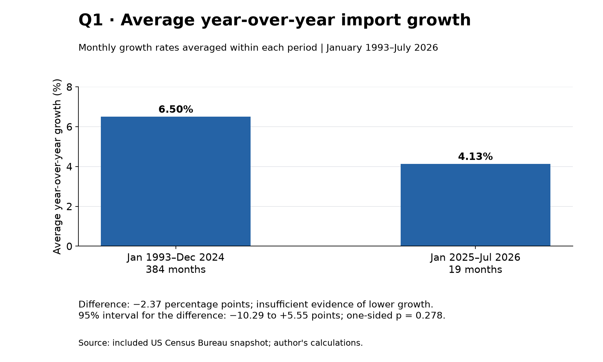
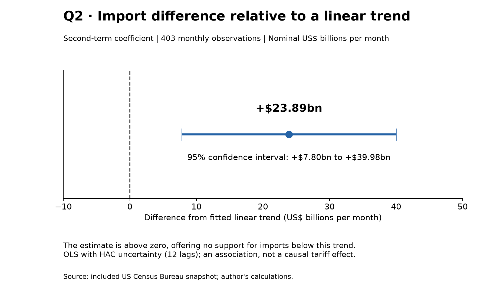
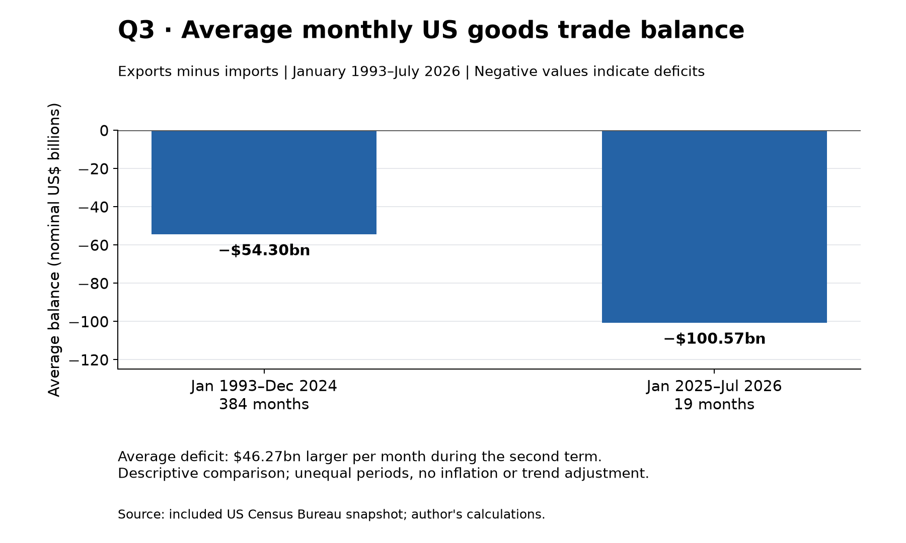

# Did Trump's Tariffs Slow US Imports? What 19 Months Can Tell Us

*Illustration generated with OpenAI's image-generation tool; not a photograph of a specific port.*

Did Trump's second-term tariffs reduce the goods entering the United States? It sounds like a straightforward question: look at imports before and after, and compare.

The data tell a less decisive story. **Import growth was lower on average during the second term, but this analysis did not find convincing evidence of a reduction attributable to tariffs.**

## What I wanted to find out

The central question was whether imports were lower than they would have been without the tariffs. To explore it, I asked three specific questions:

1. Was import growth lower during Trump's second term than in the preceding period?
2. Were import values below their long-term upward trend?
3. How did the average monthly US goods trade balance differ between the second term and the preceding period?

I used US Census Bureau monthly data on goods imports, exports, and the trade balance. Services were excluded. The analysis covers January 1993 through July 2026: **403 months in total, but only 19 during the second term**.

I counted January 2025 as the start of the second-term period, including the whole month. That comparison includes months before the April tariff announcement, allowing room for businesses to bring purchases forward in anticipation. The earlier period includes Trump's first term.

## Question 1: Was import growth lower during the second term?

**Hypothesis:** Average year-over-year import growth was lower than in the earlier period.

*Figure 1. The bars show lower average growth, but the uncertainty interval for the difference includes both decreases and increases. The directional test does not provide sufficient evidence to support the hypothesis (one-sided p = 0.278).*

To compare growth, I measured each month's imports against the same month one year earlier.

| Period | Months observed | Average year-over-year import growth |
| --- | ---: | ---: |
| January 1993-December 2024 | 384 | 6.50% |
| January 2025-July 2026 | 19 | 4.13% |
| Difference | | **-2.37 percentage points** |

*Source: calculations from the project's US Census Bureau data extract. These are averages of monthly year-over-year growth rates.*

Growth was lower by 2.37 percentage points. However, the uncertainty around that difference was too large to confidently distinguish it from ordinary variation.

Slower growth also does not mean imports fell. A positive growth rate means imports were higher than a year earlier; they were simply increasing more slowly on average.

## Question 2: Were import values below their long-term linear trend?

**Hypothesis:** Second-term monthly imports were below the fitted linear trend.

*Figure 2. The dot is the estimated second-term difference, and the horizontal line is its 95% confidence interval. Both are above zero, so this model does not support the hypothesis of lower imports (one-sided p = 0.998). This is a fitted association, not an estimate of what would have happened without tariffs.*

I also compared monthly import values with a straight-line historical trend. On that benchmark, second-term imports were approximately **$23.9 billion per month above the fitted trend**, rather than below it.

That result does not show that tariffs increased imports. It shows why the benchmark matters: imports can grow more slowly than their historical average while remaining above a projected trend in dollar values.

The two comparisons therefore offer no consistent evidence that imports were lower during the second term.

## Question 3: How did the average monthly goods trade balance differ?

**Descriptive expectation:** If imports fell while exports stayed unchanged, the trade deficit would narrow. This comparison checks the observed direction; it is not a formal hypothesis test and does not hold exports constant.

*Figure 3. The second-term bar extends farther below zero, showing a larger average deficit, rather than the narrowing in the stated expectation. Unequal period lengths and nominal dollar values limit this comparison; no statistical significance or causal effect is inferred.*

The United States runs a goods trade deficit when imports exceed exports. Before the second term, the average monthly deficit was **$54.30 billion**. During the second term, it was **$100.57 billion**—an average deficit **$46.27 billion larger per month**.

Other things equal, lower imports would narrow the deficit if exports stayed unchanged. But this comparison does not hold exports or other economic conditions constant.

The figures are not adjusted for inflation or the increasing scale of trade, and they compare 19 recent months with 384 earlier months. They describe a larger average dollar deficit; they do not establish that tariffs caused it or failed to reduce imports relative to what they otherwise would have been. This comparison is descriptive, without a statistical significance test.

## What can we conclude?

**This analysis does not provide robust evidence that Trump's second-term tariffs reduced US goods imports. It also does not establish that tariffs had no effect.**

Nineteen months is a short window, and neighboring months do not provide wholly independent evidence. Prices, exchange rates, demand, and other policies can influence the dollar value of imports. This study does not separate those influences from tariffs, and it measures spending on imported goods rather than physical quantities.

Businesses might also import more before tariffs and less afterward. Averaging the whole period can blur that pattern; this analysis does not establish whether that happened.

For now, the findings are preliminary. More observations will allow us to revisit the question, although additional data alone will not resolve every question about cause and effect.

## Data and further reading

- Data provider: [US Census Bureau, International Trade](https://www.census.gov/foreign-trade/index.html). The local extract contains observations through July 2026 and states an update date of September 3, 2026.
- [Project overview and reproduction instructions](https://github.com/groundhog-21/trump-tariffs-and-international-trade/blob/main/README.md).
- [Data preparation notebook](https://github.com/groundhog-21/trump-tariffs-and-international-trade/blob/main/notebooks/data_understanding_and_preparation.ipynb).
- [Models, statistical results, and charts](https://github.com/groundhog-21/trump-tariffs-and-international-trade/blob/main/notebooks/modeling_and_evaluation.ipynb).

*Created as part of my Udacity Data Science Nanodegree studies, with OpenAI Codex assistance for coding, writing, and discussion of methods.*
